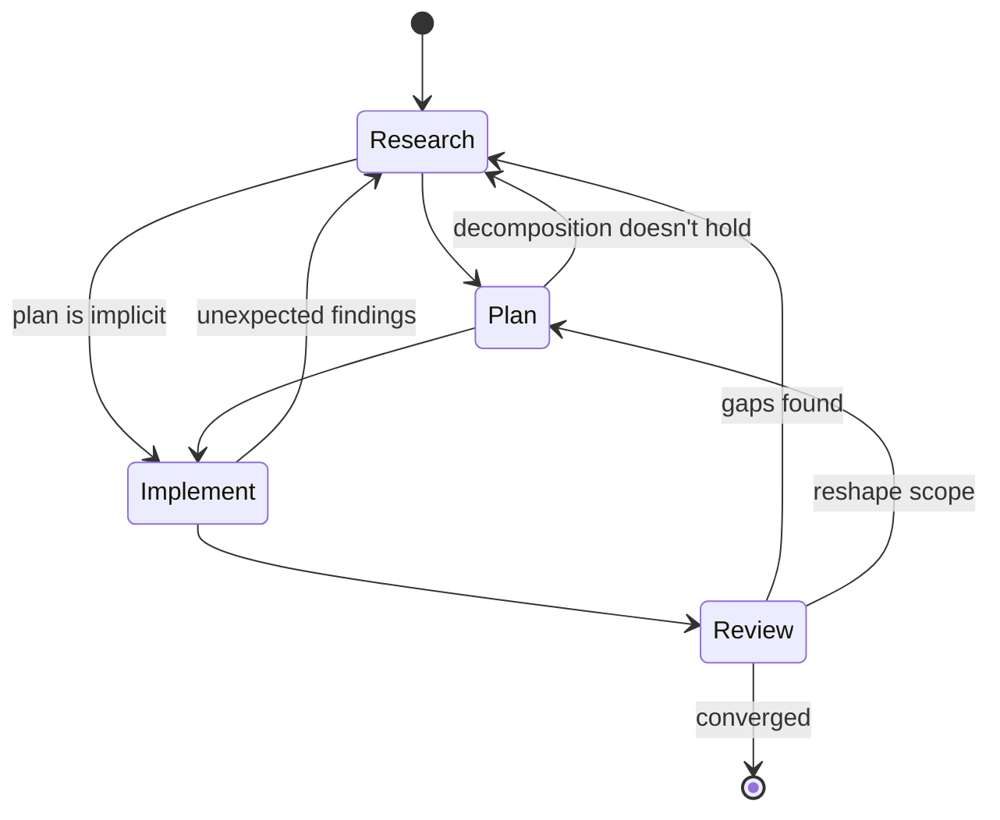

# Method

A method for orchestrating complex work with AI agents. The primary instrument is the human's qualitative attention — what to notice, when to push, where to direct. Phases give that attention structure, and the transitions between them are governed by judgment.

The method works with how agents reason and is fractal: each phase can contain any other phase, and at every scale the judgment of what to invoke is as important as the phases themselves.

For concrete techniques without the framework, see the [quick start](quick-start.md). For background, see [how this developed](formation.md).

## Phases

The method has four phases — research, plan, implement, review — that loop into each other. Any phase can loop back to any other, and at any given scale some may not be needed at all. The judgment of when to loop back, when to skip, and when to move forward is part of the method. Phases catch mismatches between the human's mental model and reality.

*Each phase contains this same cycle at a smaller scale.*
{: .note }

The human brings domain knowledge and organizational context. The [workflow docs](workflows/) are reference material for when you're starting a specific type of work — not required reading after this page.

### Research

Gather material, notice patterns, let the structure emerge. Research starts with directed attention — sometimes a clear picture of what's needed, sometimes an open question.

Parallel agents are a natural fit. Each agent enters deeply into a limited area and the human and orchestrating agent synthesize across them.

Research builds two things explicitly:

- **Findings** — what's been observed, with provenance and interpretation
- **Assumptions** — what's been taken as given, with risk level and verification method

Both accumulate as the work progresses. The human and agent both identify gaps — the human recognizing where a domain is underexplored or where evidence is shallow, and directing the agent to look for what's missing — and iterate on the lists together. As the signal-to-noise ratio shifts, findings and assumptions can be [condensed](#knowledge-accumulation).

**Research is done when findings stop surprising.** It can also end because the scope doesn't warrant going deeper — the question is answered well enough for the work at hand.

Sometimes the research itself produces the plan — the investigation reveals the fix, and a separate planning phase adds nothing.

### Plan

Decompose what research surfaced into steps. The human provides direction, the agent drafts, and they iterate until the decomposition holds.

Planning is where the fractal structure is most visible — the plan determines what the other phases look like at the next scale down. What looked like a clean decomposition often shifts when the steps are structured, which can reopen research or reshape scope.

### Implement

Execute the plan. Implementation has higher agent autonomy, but it contains its own cycles of research, planning, and review as the work reveals things the plan didn't anticipate.

As the agent works, it encounters things the research didn't surface — edge cases, unexpected couplings, assumptions that don't hold in practice. These findings need to flow back to the orchestration level. The agent surfaces what it's found at defined breakpoints:

- When something is **load-bearing** — the plan depends on it, or other decisions cascade from it
- When it's **cheap to verify now** and expensive to fix later

> Surprises during implementation are a signal to widen the review scope — what else did the plan miss?
{: .important }

### Review

Review works best with multiple passes from different angles. The angles emerge from the work — technical, structural, contextual, or shaped by something specific the process surfaced. What matters is that each pass enters one perspective deeply, and that the perspectives catch different categories of issue.

Repeated passes of the same type also have value: each review changes the artifact, so the same perspective applied to evolved material yields different results.

Review can also surface findings that reshape the plan or reopen research — the finding's nature determines where it goes. Review is done when new passes produce diminishing findings.

## Scale and judgment

At a given scale, some phases may not be needed: a well-understood task might skip research, a clear diagnosis might make planning implicit. Sometimes review sends you back to research; sometimes moving forward is the right call. The judgment is the human's.

## Working with how agents reason

The workflow is structured to leverage how agents reason in practice — making connections across their context in ways that don't follow linear paths. See [agent patterns](agent-patterns.md) for the specific behavioral patterns behind these choices:

- **Scoping agent context deliberately.** Each agent gets the specific context it needs for its task. Unnecessary context creates anchoring; insufficient context creates blind spots.
- **Letting findings accumulate before structuring.** Research and early review give agents room to surface unexpected connections before planning and implementation impose structure.
- **Parallel execution as default.** When two investigations don't depend on each other, they run simultaneously. Findings cross-pollinate at synthesis time in ways sequential execution misses.

## Knowledge accumulation

Findings and assumptions need to survive context boundaries — passed between agents, carried across sessions, loaded into fresh agents that have no history with the work.

- **Assumptions are tracked across their lifecycle.** Some are verified, some invalidated, some absorbed into broader understanding. Assumption triage (investigate/defer/skip) keeps the signal-to-noise ratio manageable.
- **Findings carry their context.** A finding without its provenance — what question it answered, what it assumed, what produced it — can't be usefully loaded into a fresh agent's context.

When accumulated knowledge gets heavy, the human notices and the agent helps identify what can be condensed. What's condensed should preserve the reasoning behind each finding — a fresh agent needs that reasoning to work with the material.

## The human role

The human brings domain knowledge, experience, and organizational context. The core of the role is directing attention — recognizing where the work needs to go and what's getting in the way:

- **Gap recognition.** Noticing what's missing — sometimes as a specific observation, sometimes as a pre-articulable sense that something isn't right.
  - This includes directing the agent to look for gaps the human suspects but can't yet pinpoint. The capacity sharpens with experience. See [background](formation.md) for more on how this attention develops.
- **Calibration.** Agents are biased toward what's local — what's visible in their current context.
  - They may flag things as needing human judgment when their tools could resolve the question. Before accepting an escalation, consider whether available evidence could resolve it.
  - This bias has a temporal dimension: the more revision cycles an artifact has been through, the more the agent treats its current shape as load-bearing, even when feedback says otherwise.
- **Friction by invitation.** Explicitly asking the agent to push back — counter an intuition, find weakness in a direction, challenge an assumption. The human controls when to open that space.
- **Phase authority.** Deciding when research is sufficient, when the plan is ready, when implementation should stop, when review has converged.
- **Batch feedback.** Accumulating observations and delivering them together at multiple scales.
  - This gives the agent the full pattern rather than individual instances.

## Convergence

**The signal.** New passes confirm rather than extend. Findings stop surprising.

**Recognition.** The practitioner recognizes convergence before they can fully justify it — in the decreasing novelty of each pass and the consistency across angles — then verifies formally.

**False convergence.** Premature closure happens — fatigue mistaken for completion, or a blind spot that feels like coverage. Multi-angle review is the defense: if convergence holds across several perspectives, it's more likely real. If a new perspective finds significant issues, the work continues.

## When to use this

This method is for complex work where the output depends on synthesis across sources or perspectives. Architecture investigations, research documents, multi-file implementation efforts, vendor evaluations — anything that benefits from parallel exploration and iterative refinement.

> If parallel agents, multiple review passes, or assumption tracking would help, this method applies. If the task fits in your head and one pass handles it, direct execution works.
