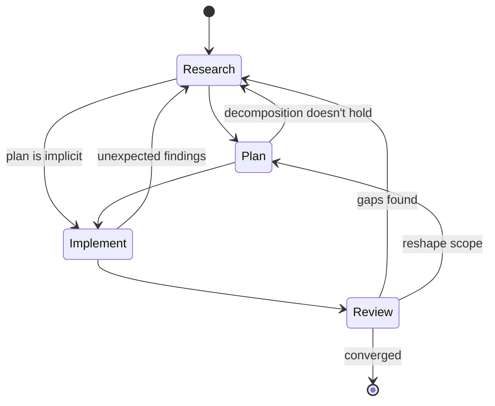

# Method

A method for orchestrating complex work with AI agents. Research, plan, implement, review — four phases that loop into each other at every scale. What holds them together is the human's qualitative attention (what to notice, when to push).

The method works with how agents reason and is fractal: each phase can contain any other phase. Choosing what to use at a given scale matters as much as the phases themselves.

For concrete techniques without the framework, see the [quick start](quick-start.md). For background, see [how this developed](formation.md).

## Phases

Any phase can loop back to any other, and at any given scale some may not be needed at all. Deciding when to loop back and when to move forward is part of the method. Phases catch mismatches between the human's mental model and reality.

*Each phase contains this same cycle at a smaller scale.*
{: .note }

The human brings domain knowledge and organizational context. The [workflow docs](workflows/) are reference material for starting a specific type of work — not required reading after this page.

### Research

Gather material, notice patterns, let the structure emerge. Research starts with directed attention — sometimes a clear picture of what's needed, sometimes an open question.

Parallel agents are a natural fit. Each agent focuses on a limited area and the human and orchestrating agent synthesize across them.

Agents generate assumptions silently as they work — filling gaps in their context with plausible premises. Research makes these visible by tracking two things explicitly:

- **Findings** — what's been observed, with provenance and interpretation
- **Assumptions** — what's been taken as given, exposed so the human can investigate what matters

As findings and assumptions accumulate, they can be [condensed](#knowledge-accumulation).

**Research is done when findings stop surprising.** It can also end because the scope doesn't warrant going deeper — the question is answered well enough for the work at hand.

Sometimes the research itself produces the plan — the investigation reveals the fix, and a separate planning phase adds nothing.

### Plan

Decompose what research found into steps. The human provides direction, the agent drafts, and they iterate until the decomposition holds.

Planning is where the fractal structure is most visible — the plan determines what the other phases look like at the next scale down. What looked like a clean decomposition often shifts when the steps are structured, which can reopen research or reshape scope.

### Implement

Execute the plan. Implementation has higher agent autonomy, but it contains its own cycles of research, planning and review as the work reveals things the plan didn't anticipate.

As the agent works, it encounters things the research missed — edge cases, unexpected couplings, assumptions that don't hold in practice. The agent reports what it's found at defined breakpoints:

- When something is **load-bearing** — the plan depends on it, or other decisions cascade from it
- When it's **cheap to verify now** and expensive to fix later

> Surprises during implementation are a signal to widen the review scope — what else did the plan miss?
{: .important }

An agent that encounters fundamental problems should stop and surface them rather than work around them. See [scope completion bias](agent-patterns.md#scope-completion-bias) for why agents tend toward the opposite. What implementation discovers — assumptions invalidated, coupling not in the design — should inform how review is scoped.

### Review

Review works best with multiple passes from different angles. The angles emerge from the work — technical, structural, contextual or shaped by something specific the process revealed. What matters is that each pass enters one perspective deeply, and that the perspectives catch different categories of issue.

Evaluative reviewers — those checking quality, correctness, maintainability — should not see the implementation plan. The plan creates anchoring: a reviewer who knows what the code was supposed to do evaluates against intent rather than reality. Alignment reviews ("did we build what we planned?") are different; those need the plan.

Repeated passes of the same type also have value: each review changes the artifact, so the same perspective applied to evolved material yields different results.

Review can also surface findings that reshape the plan or reopen research — the finding's nature determines where it goes. Review is done when new passes produce diminishing findings.

## Scale and judgment

At a given scale, some phases may not be needed: a well-understood task might skip research, a clear diagnosis might make planning implicit. Sometimes review sends you back to research; sometimes moving forward is the right call. The judgment is the human's.

## Working with how agents reason

The workflow is structured around how agents reason in practice — connecting material across their context non-linearly. See [agent patterns](agent-patterns.md) for the specific behavioral patterns behind these choices:

- **Scoping agent context deliberately.** Each agent gets what it needs for its task. Unnecessary context creates anchoring, insufficient context creates blind spots. Scoping also has a security dimension — agents with unnecessary context have unnecessary access.
- **Letting findings accumulate before structuring.** Research and early review give agents room to find unexpected connections before planning and implementation impose structure.
- **Parallel execution as default.** When two investigations don't depend on each other, they run simultaneously. Findings connect at synthesis time in ways sequential execution misses.

## Knowledge accumulation

As findings and assumptions accumulate, agents lose focus — spending more effort processing noise than doing useful work. Findings also need to survive context boundaries: passed between agents, carried across sessions, loaded into fresh agents that have no history with the work.

- **Assumptions are tracked across their lifecycle.** Some are verified, some invalidated, some absorbed into broader understanding. Assumption triage (investigate/defer/skip) keeps the signal-to-noise ratio manageable.
- **Findings carry their context.** A finding without its provenance — what question it answered, what it assumed, what produced it — can't be usefully loaded into a fresh agent's context.

When accumulated knowledge gets heavy, the human notices and the agent helps identify what can be condensed — simplify, reduce noise, and highlight the overarching concerns. What's condensed should preserve the reasoning behind each finding — a fresh agent needs that reasoning to work with the material.

## The human role

The core of the human role is directing attention:

- **Gap recognition.** Noticing what's missing — sometimes as a specific observation, sometimes as a pre-articulable sense that something isn't right.
  - This includes directing the agent to look for gaps the human suspects but can't yet pinpoint. See [background](formation.md) for more on how this attention develops.
- **Calibration.** Agents are biased toward what's local — what's visible in their current context. See [locality bias](agent-patterns.md#locality-bias) and [over-escalation](agent-patterns.md#over-escalation) for why.
  - They may flag things as needing human judgment when their tools could resolve the question. Before accepting an escalation, consider whether available evidence could resolve it.
  - The more revision cycles an artifact has been through, the more the agent treats its current shape as load-bearing, even when feedback says otherwise.
- **Friction by invitation.** Explicitly asking the agent to push back — counter an intuition, find weakness in a direction, challenge an assumption. The human controls when to open that space. See [sycophancy amplification](agent-patterns.md#sycophancy-amplification) for why this matters.
- **Phase authority.** Deciding when research is sufficient, when the plan is ready, when implementation should stop, when review has converged.
- **Batch feedback.** Accumulating observations and delivering them together at multiple scales.
  - This gives the agent the full pattern rather than individual instances.
- **Sustainability.** Directing attention across multiple parallel workstreams degrades judgment when the human can't keep pace with the throughput. Unstructured time away from the work — letting the back burner process what's accumulated — is part of keeping that attention sharp.

The method is scoped to a single practitioner and their agents. It doesn't address how the practitioner's judgment is evaluated by others, how trust is established within a team or how the method interacts with organizational process gates. These are open questions — see [what's changing](whats-changing.md) for one perspective.

## Convergence

**The signal.** New passes confirm rather than extend. Findings stop surprising. The practitioner often recognizes convergence before they can fully justify it — the fifth review comes back with nothing new, different angles are finding the same things — then verifies formally.

**False convergence.** Premature closure happens — fatigue mistaken for completion, or a blind spot that feels like coverage. Multi-angle review is the defense: if convergence holds across several perspectives, it's more likely real. If a new perspective finds significant issues, the work continues.

## When to use this

This method is for complex work where the output depends on synthesis across sources or perspectives. Architecture investigations, research documents, multi-file implementation efforts, vendor evaluations — anything that benefits from parallel exploration and iterative refinement.

> If parallel agents, multiple review passes, or assumption tracking would help, this method applies. If the task fits in your head and one pass handles it, direct execution works.
