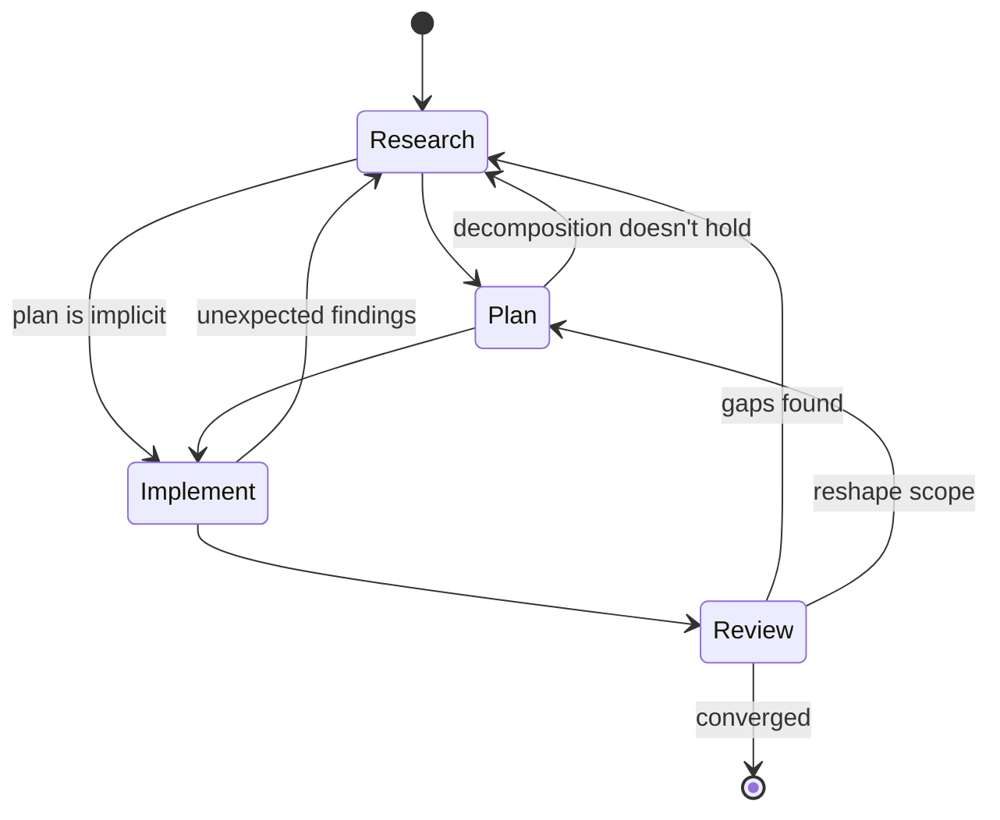

# Method

A method for orchestrating complex work with AI agents. The primary instrument is the human's qualitative attention — what to notice, when to push, where to direct. Phases give that attention operational structure, and the transitions between them are governed by judgment. The method works with how agents reason and is fractal: each phase can contain any other phase, and at every scale the judgment of what to invoke is as important as the phases themselves.

It emerged from practice and is structured here for others to use. For concrete techniques without the framework, see the [quick start](quick-start.md). For background on why the method has its particular character, see [formation](formation.md).

## Phases

The method has four phases — research, plan, implement, review — that operate as activities referring to each other. Any phase can loop back to any other, and at any given scale some may not be needed at all. The judgment of when to loop back, when to skip, and when to move forward is part of the method. Phases exist to catch mismatches between the human's mental model and reality — skip a phase when the model is already accurate for that phase's concerns.

*Each phase contains this same cycle at a smaller scale.*

The human brings domain knowledge and organizational context. The agent brings throughput and associative reach. The exchange between them is where the method lives — dialogical in research, collaborative in planning and implementation, iterative in review. The workflow docs — [research](workflows/research.md), [planning](workflows/planning.md), [implementation](workflows/implementation.md), [review](workflows/review.md), and [documentation](workflows/documentation.md) — describe how the phases compose for specific types of work.

### Research

Gather material, notice patterns, let the structure become legible. Research starts with directed attention — sometimes a clear picture of what's needed, sometimes an open question — and lets findings accumulate until the shape emerges.

Parallel agents are a natural fit. Each agent enters deeply into a limited area and the human and orchestrating agent synthesize across them.

Research builds two things explicitly: **findings** (what's been observed, with provenance and interpretation) and **assumptions** (what's been taken as given, with risk level and verification method). Both accumulate as the work progresses. The human and agent both identify gaps — the human recognizing where a domain is underexplored or where evidence is shallow, and directing the agent to look for what's missing — and iterate on the lists together. As the signal-to-noise ratio shifts, findings and assumptions can be [condensed](#knowledge-accumulation). Through this iteration, the human builds domain familiarity that makes each successive pass more productive.

Research is done when new passes confirm rather than extend — when the findings stop surprising. This is a [convergence](#convergence) signal, recognized before it's verified formally. Research can also end because the scope doesn't warrant going deeper — the question is answered well enough for the work at hand. Sometimes the research itself produces the plan — the investigation reveals the fix, and a separate planning phase adds nothing.

### Plan

Decompose what research surfaced into steps. The human provides direction, the agent drafts, and they iterate until the decomposition holds.

Planning is itself a loop. What looked like a clean decomposition often shifts when the steps are structured, which can reopen research or reshape scope.

### Implement

Execute the plan. Implementation has higher agent autonomy, but it contains its own cycles of research, planning, and review as the work reveals things the plan didn't anticipate.

Implementation produces knowledge alongside output. As the agent works, it encounters things the research didn't surface — edge cases, unexpected couplings, assumptions that don't hold in practice. These findings need to flow back to the orchestration level. The agent surfaces what it's found at defined breakpoints:

- When something is **load-bearing** — the plan depends on it, or other decisions cascade from it
- When it's **cheap to verify now** and expensive to fix later

Surprises during implementation are a signal that review needs to be thorough, not an excuse to skip it. Scope creep during implementation often signals that planning was insufficient.

### Review

Examine the output against expectations. Look for gaps and inconsistencies — areas where the depth of evidence is uneven, where conclusions aren't supported, or where something that should be addressed is missing.

Review works best with multiple passes from different angles. The angles emerge from the work — technical, structural, contextual, or shaped by something specific the process surfaced. What matters is that each pass enters one perspective deeply, and that the perspectives catch different categories of issue. Repeated passes of the same type also have value: each review changes the artifact, so the same perspective applied to evolved material yields different results.

Review can also surface findings that reshape the plan or reopen research — the finding's nature determines where it goes. Review that only produces fixes within the current artifact is underpowered; the most valuable findings reshape understanding of the broader work. Review is done when new passes produce diminishing findings.

## The pattern and when to use it

The pattern is available at every scale — a months-long investigation and a paragraph revision both follow it — but it's not mandatory. At a given scale, some phases may not be needed: a well-understood task might skip research, a clear diagnosis might make planning implicit. Sometimes review sends you back to research; sometimes moving forward is the right call. The judgment is the human's, and it's a core part of the method.

## Working with how agents reason

The workflow is structured to leverage how agents reason in practice — making connections across their context in ways that don't follow linear paths. This is a design principle (see [agent patterns](agent-patterns.md) for the specific behavioral patterns the method is designed around):

- **Scoping agent context deliberately.** Each agent gets the specific context it needs for its task — not more, not less. Unnecessary context creates anchoring (a reviewer evaluating code quality shouldn't see the implementation plan — it shifts evaluation from what the code does to whether it matches intent); insufficient context creates blind spots. Bounded context per agent, integration at a higher level.
- **Letting findings accumulate before structuring.** Research and early review give agents room to surface unexpected connections before planning and implementation impose structure.
- **Parallel execution as default.** When two investigations don't depend on each other, they run simultaneously. Findings cross-pollinate at synthesis time in ways sequential execution misses.

Non-determinism is a feature when the workflow is designed to channel it: bounded scope per agent, accumulation before structure, synthesis at the orchestration level.

## Knowledge accumulation

Knowledge in this method accumulates in layers. Earlier understanding stays visible alongside new findings — annotated, revisited, carried forward. The relationship between layers is part of the knowledge.

- **Assumptions are tracked across their lifecycle.** Some are verified, some invalidated, some absorbed into broader understanding. The assumption list changes shape as the work evolves. Assumption triage (must/should/skip/defer) keeps the signal-to-noise ratio manageable.
- **Findings carry their context.** A finding without its provenance — what question it answered, what it assumed, what produced it — loses value over time.
- **Condensation is a joint act.** When the accumulated knowledge gets heavy, the human notices and the agent helps identify what can be condensed. What's condensed should preserve the specificity and nuance of what it replaces — a summary that loses the reasoning behind a finding is worse than the original.

## The human role

The human brings domain knowledge, experience, and organizational context to the work. These shape what the human notices, what questions they ask, and how they evaluate the agent's output.

The core of the human role is directing attention — recognizing where the work needs to go and what's getting in the way. Experienced practitioners already do much of this intuitively; the method makes it explicit and designs around it:

- **Gap recognition.** Noticing what's missing — sometimes as a specific observation (evidence is inconsistent, a domain is underexplored), sometimes as a pre-articulable sense that something isn't right. This includes directing the agent to look for gaps the human suspects but can't yet pinpoint. The capacity sharpens with experience — both with the domain and with the method itself. See [formation](formation.md) for more on how this attention develops.
- **Calibration.** Agents are biased toward what's local — what's visible in their current context. They may flag things as needing human judgment when their tools could resolve the question. More broadly, the agent can't see what's outside its context window. This bias also has a temporal dimension: the more revision cycles an artifact has been through, the more the agent treats its current shape as load-bearing, even when feedback says otherwise. Noticing these forms of locality bias and directing the agent past them is a significant part of the work. Questions that appear to require human domain expertise are often answerable from data the agent can access. Before accepting an escalation, consider whether available evidence could resolve it.
- **Friction by invitation.** Explicitly asking the agent to push back — counter an intuition, find weakness in a direction, challenge an assumption. The method is more productive when the exchange is bidirectional, and the human controls when to open that space.
- **Phase authority.** Deciding when research is sufficient, when the plan is ready, when implementation should stop, when review has converged. The agent can propose; the human decides.
- **Batch feedback.** Accumulating observations and delivering them together at multiple scales rather than correcting piecemeal. This gives the agent the full pattern rather than individual instances.

## Convergence

Convergence is the signal that a phase — or the whole effort — is approaching completion. New passes confirm rather than extend. Findings stop surprising.

This is how expert judgment generally works — the practitioner recognizes the signal before they can fully justify it, then verifies. The method's contribution is making this explicit: the human sees it in the decreasing novelty of each pass and the consistency across angles, then verifies formally.

Convergence can be wrong. Premature closure happens — fatigue mistaken for completion, or a blind spot that feels like coverage. Multi-angle review is the defense: if convergence holds across several perspectives, it's more likely real. If a new perspective finds significant issues, the work continues.

## When to use this

This method is designed for complex work where the output depends on synthesis across sources or perspectives. Architecture investigations, research documents, multi-file implementation efforts, vendor evaluations — anything that benefits from parallel exploration and iterative refinement.

The threshold: if parallel agents, multiple review passes, or assumption tracking would help, this method applies. If the task fits in your head and one pass handles it, direct execution works.
