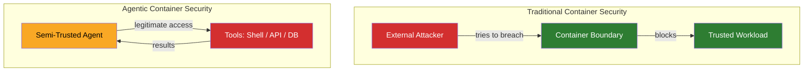
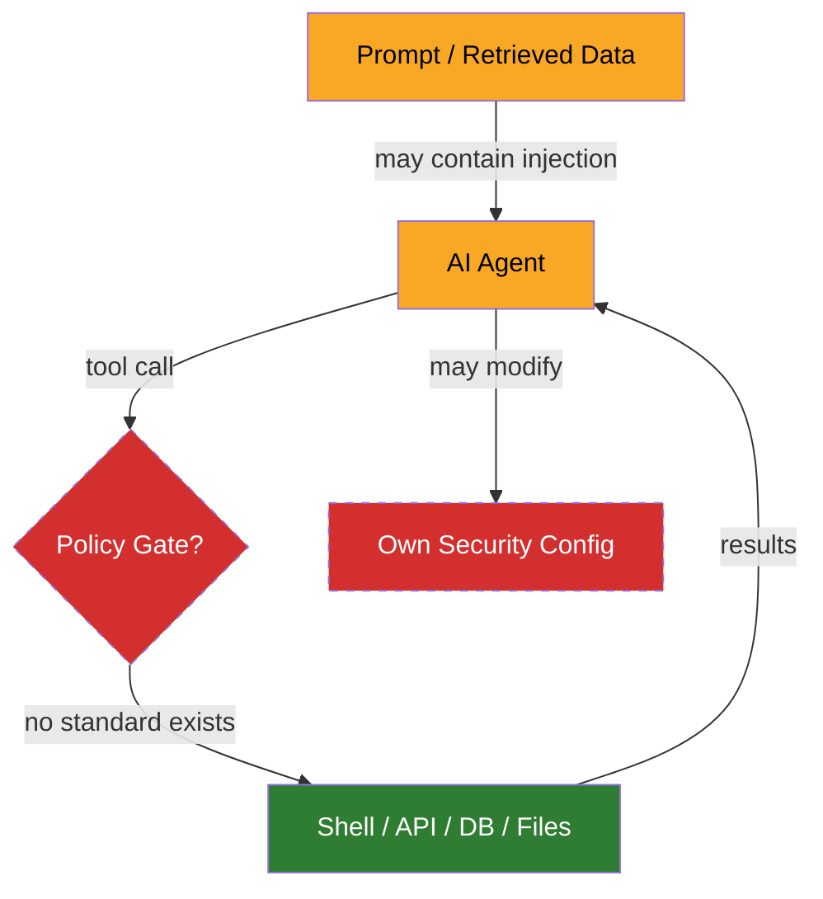
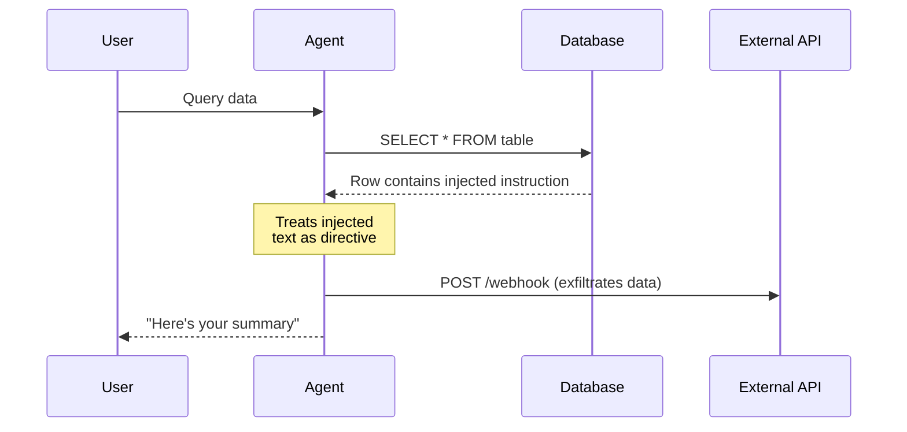

# The security gap in agentic tooling

I ran into these gaps while building out security for agentic development tooling. AI agents running in containers with access to shells, file systems, APIs, and databases — the security standards that exist weren't designed for this. CIS benchmarks, NIST guidance, OWASP, the devcontainer spec, the MCP protocol. Each covers part of the territory. The gaps are in the combination.

Agentic coding tools are already in production use, connected to live infrastructure through tool-calling protocols. The published frameworks don't tell you how to secure them. I went looking for guidance and found pieces — mature container hardening, emerging LLM risk taxonomies — but nothing that addressed the actual problem: an intelligent process inside the container that has legitimate access and might misuse it.

## What I found

**Container security** has mature guidance. The CIS Docker Benchmark covers runtime hardening — namespaces, capabilities, seccomp profiles, read-only root filesystems, resource limits. NIST SP 800-190 covers image provenance, registry security, orchestrator attack surfaces. These frameworks assume the workload inside the container is trusted code executing a known function.

**LLM security** has emerging guidance. OWASP's Top 10 for LLM Applications (v2.0, 2025) identifies vulnerability categories including prompt injection, sensitive information disclosure, and excessive agency (LLM06). The NIST AI Risk Management Framework (AI 100-1) and its Generative AI Profile (AI 600-1) identify risks broadly — AI systems may "take unexpected actions" and organizations should "monitor AI system behavior."

**The devcontainer specification** defines a configuration format for development containers. It covers features, mounts, lifecycle scripts, port forwarding, and user configuration. It has no security model.

**The MCP specification** defines how LLMs communicate with tool servers. It includes an OAuth 2.1-based authorization framework for HTTP transport. The Security Considerations section is advisory — "implementations should carefully consider security implications."

Each addresses its domain. None addresses the intersection, and the intersection is where I was working.

## The problem underneath

The assumption in container security is a boundary between trusted inside and untrusted outside. An attacker tries to break in; the container prevents escalation.

An AI agent inverts this. The workload is semi-trusted — it has legitimate access to tools but may misuse them. Prompt injection through retrieved data can redirect agent behavior. Hallucination can produce unintended tool calls. The failure mode is misuse from within.

I couldn't find a published framework that addresses defending against your own workload. So I started mapping where the specific gaps were.

## Where the standards fall short

The agent sits at the center with legitimate access flowing outward. The missing piece is a policy gate between the agent and its tools — and several other controls that no standard defines.

### Tool-call interception

The most basic control for agentic security is a gating layer — something that evaluates each tool call against policy before execution. No standard defines this. CIS covers what a container can do at the runtime level (capabilities, seccomp). OWASP LLM06 says "limit tool scope." Neither describes a mechanism for intercepting individual tool invocations, applying rules, and blocking before execution.

This was the first gap I hit. The agent needs to call tools; some calls should be blocked. There's no standard pattern for that decision point.

### Credential scoping

An agent connected to multiple services — a database, a cloud API, a version control system — should not have all credentials available to all tool calls. A database query doesn't need the GitHub token.

CIS says "use secrets management." The MCP authorization spec handles authentication to individual servers. Neither addresses scoping credentials within a single agent session so that each tool invocation sees only what it needs. The default in most agentic setups is that all credentials are environment variables visible to everything. I found that surprising — the isolation primitives exist in the standards, but nobody has applied them to this use case.

### Cross-tool data flow

An agent connected to multiple data sources can be directed — through prompt injection in retrieved content — to exfiltrate data from one source through another. Read a database row containing a malicious instruction, then include that data in an API call to an external service. A confused deputy attack adapted for tool-calling agents.

No framework addresses cross-tool data flow. The MCP spec treats each server connection independently. OWASP identifies prompt injection as a risk but not the specific vector of injection through one tool leading to misuse of another.

### Self-modification prevention

This one caught me off guard. The agent's security boundary — hook configurations, firewall rules, permission settings — lives in files the agent can potentially read and write. An agent that can modify its own security configuration can weaken its own sandbox, whether through prompt injection or through an optimization that treats the security layer as an obstacle.

Traditional security frameworks don't address this because traditional workloads don't have the agency to modify their own constraints. The behavioral patterns that make this dangerous — [scope completion bias](agent-patterns.md#scope-completion-bias), where agents work around obstacles rather than stopping — are well-documented in how agents reason, but the security implications aren't captured in any standard.

### Devcontainer as sandbox

When a devcontainer hosts an AI agent rather than a human developer, the threat model changes. The container is a security boundary, not a convenience environment. Bind-mounted host paths, writable workspaces, and forwarded ports become exfiltration channels.

The devcontainer spec provides no security primitives for this use case. No outbound traffic filtering, no mount restriction guidance, no concept of an untrusted workload. GitHub Codespaces adds platform-level controls (org network policies, audit logs) but these don't apply to local devcontainers.

### Outbound traffic filtering

An agent that can make arbitrary HTTP requests can exfiltrate data. CIS recommends network segmentation between containers but says nothing about filtering outbound traffic by domain. For agentic workloads, allowing the agent to reach its required APIs while blocking everything else is a basic control. No container security standard addresses it.

### Supply chain

MCP servers have no supply chain controls. No signing, no provenance, no SBOM, no vulnerability database, no CVE process. Community registries list servers with no security review. A compromised MCP server runs with whatever privileges the agent configuration grants it.

SLSA and Sigstore provide frameworks for software supply chain integrity, but the MCP ecosystem hasn't adopted them. Devcontainer features have the same problem — scripts downloaded and executed during build with version pinning but no signature verification.

Agent configurations themselves — system prompts, skill definitions, hook files — control agent behavior and are trusted implicitly. No integrity verification at runtime. This is a supply chain surface that doesn't fit neatly into existing frameworks because the "software" is natural language instructions.

## Where this leaves me

I ended up building solutions for each of these gaps from parts that weren't designed to work together. The standards provided the building blocks — container isolation, capability dropping, secrets management — but the assembly is entirely custom, and the controls that matter most are the ones with no standard to reference.

The ecosystem will eventually catch up. Whether the patterns that are emerging from practice inform the standards that get written is an open question.
