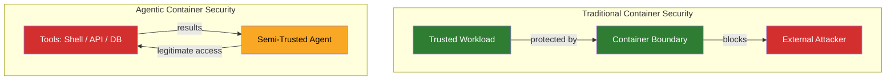
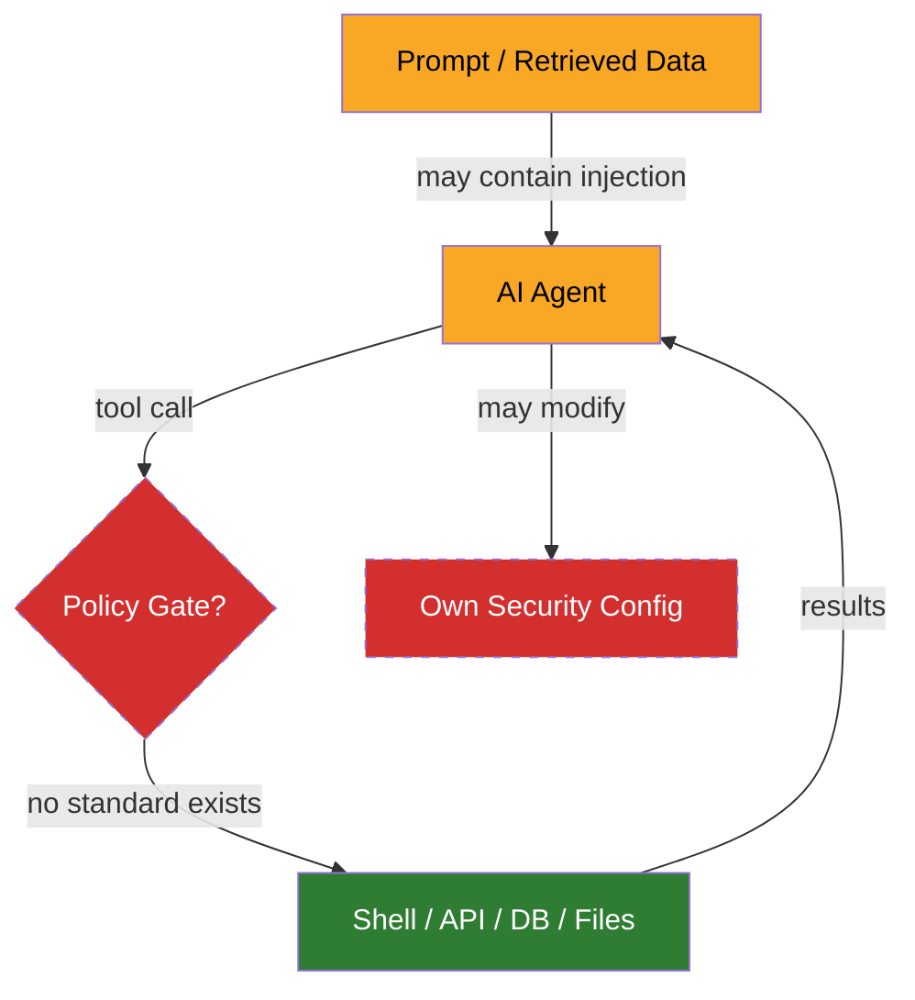
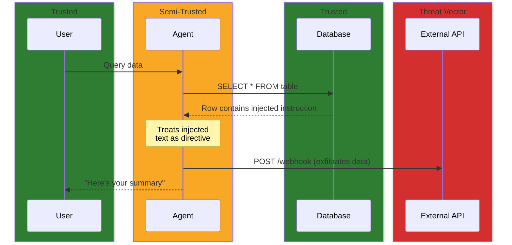

# The security gap in agentic tooling

I needed to secure AI agents running in containers with access to shells, file systems, APIs, and databases. There's published guidance for each of those surfaces individually. But the gaps I kept hitting were in the intersection, where an agent with legitimate tool access becomes the threat, and nothing I found addresses that.

## The problem underneath

Container security assumes a boundary between trusted inside and untrusted outside. An attacker tries to break in; the container prevents escalation.

An AI agent inverts this. The workload is semi-trusted. It has legitimate access to tools but may misuse them. Prompt injection through retrieved data can redirect agent behavior. Hallucination can produce unintended tool calls. The failure mode is misuse from within.

I couldn't find a published framework that addresses defending against your own workload. So I started mapping where the specific gaps were.

## The gaps

The agent sits at the center with legitimate access flowing outward. The missing piece is a policy gate between the agent and its tools, and several other controls that no standard defines.

### Tool-call interception

This was the first gap I hit. The agent needs to call tools; some calls should be blocked. A gating layer, something that evaluates each tool call against policy before execution. No standard defines this pattern. Existing container security covers what a container can do at the runtime level (capabilities, seccomp). LLM security guidance says "limit tool scope." Neither describes a mechanism for the decision point between the agent and the tool.

### Credential scoping

An agent connected to multiple services should not have all credentials available to all tool calls. A database query doesn't need the GitHub token.

The default in most agentic setups is that all credentials are environment variables visible to everything. The isolation primitives exist, but nobody has applied them to scoping credentials within a single agent session so that each tool invocation sees only what it needs.

### Cross-tool data flow

An agent connected to multiple data sources can be directed, through prompt injection in retrieved content, to exfiltrate data from one source through another. Read a database row containing a malicious instruction, then include that data in an API call to an external service. A confused deputy attack adapted for tool-calling agents.

No framework addresses cross-tool data flow. Tool-calling protocols treat each server connection independently. Prompt injection is recognized as a risk, but not the specific vector of injection through one tool leading to misuse of another.

### Self-modification prevention

The agent's security boundary (hook configurations, firewall rules, permission settings) lives in files the agent can potentially read and write. An agent that can modify its own security configuration can weaken its own sandbox, whether through prompt injection or through an optimization that treats the security layer as an obstacle.

The behavioral patterns that make this dangerous, like [scope completion bias](agent-patterns.md#scope-completion-bias) where agents work around obstacles rather than stopping, are well-documented in how agents reason. The security implications aren't captured anywhere.

### Devcontainer as sandbox

When a devcontainer hosts an AI agent rather than a human developer, the threat model changes. The container is a security boundary. Bind-mounted host paths, writable workspaces, forwarded ports, shared network namespaces. These become exfiltration channels.

The devcontainer spec provides no security primitives for this use case. No outbound traffic filtering, no mount restriction guidance, no concept of an untrusted workload.

### Outbound traffic filtering

An agent that can make arbitrary HTTP requests can exfiltrate data. For agentic workloads, allowing the agent to reach its required APIs while blocking everything else is a basic control. No container security standard addresses domain-level outbound filtering.

### Supply chain

MCP servers have no supply chain controls. No signing, no provenance, no vulnerability database. Community registries list servers with no security review. A compromised MCP server runs with whatever privileges the agent configuration grants it.

Agent configurations themselves (system prompts, skill definitions, hook files, permission manifests) control agent behavior and are trusted implicitly. No integrity verification at runtime. This is a supply chain surface that doesn't fit neatly into existing frameworks because the "software" is natural language instructions.

## Where this leaves me

I ended up building solutions for each of these gaps from parts that weren't designed to work together. Container isolation, capability dropping, secrets management, outbound filtering as building blocks, but the assembly is entirely custom. The controls with no standard to reference are the ones I spent the most time on.

Whether the patterns emerging from practice inform the standards that get written is an open question.
