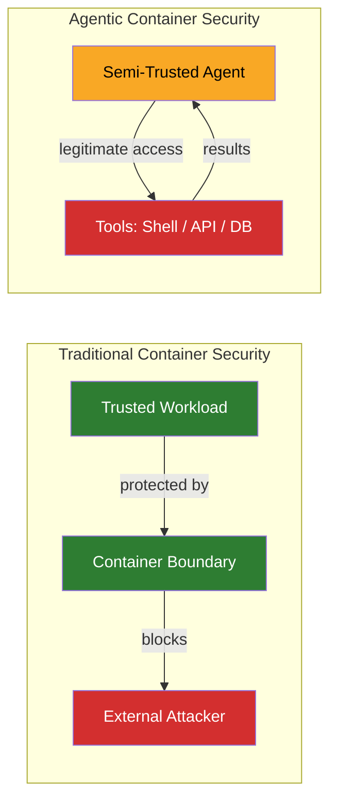
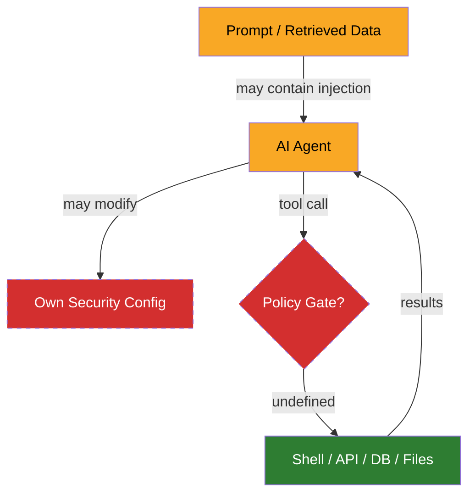
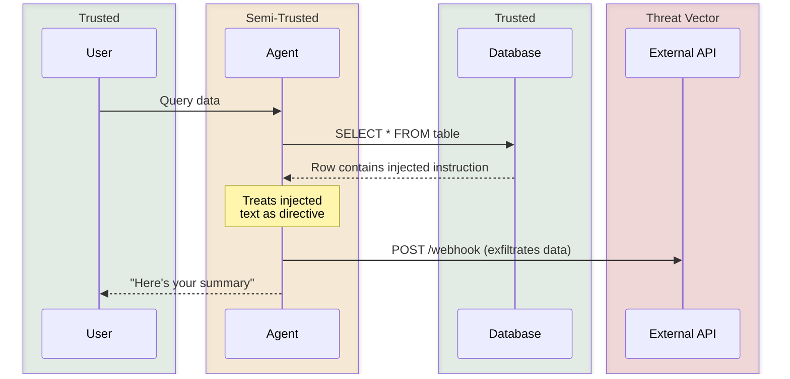

# The security gap in agentic tooling

I needed to secure AI agents running in containers with access to shells, file systems, APIs, and databases. I ran into gaps. The security standards that exist weren't designed for this.

## The problem underneath

Container security assumes a boundary between trusted inside and untrusted outside. An attacker tries to break in; the container prevents escalation.

An AI agent inverts this. The workload is semi-trusted. It has legitimate access to tools but may misuse them. Prompt injection through retrieved data can redirect agent behavior. Hallucination can produce unintended tool calls. The failure mode is misuse from within.

Defending against your own workload is the problem, and it's not one the existing frameworks were built for.

## The gaps

The agent sits at the center with legitimate access flowing outward. The missing piece is a policy gate between the agent and its tools.

### Tool-call interception

The agent needs to call tools; some calls should be blocked. A gating layer, something that evaluates each tool call against policy before execution.

### Credential scoping

An agent connected to multiple services should not have all credentials available to all tool calls. A database query doesn't need the GitHub token.

The default in most agentic setups is that all credentials are environment variables visible to everything. The isolation primitives exist, but they haven't been applied to scoping credentials within a single agent session.

### Cross-tool data flow

An agent connected to multiple data sources can be directed, through prompt injection in retrieved content, to exfiltrate data from one source through another. Read a database row containing a malicious instruction, then include that data in an API call to an external service. A confused deputy attack adapted for tool-calling agents.

### Self-modification prevention

The agent's security boundary (hook configurations, firewall rules, permission settings) lives in files the agent can potentially read and write. An agent that can modify its own security configuration can weaken its own sandbox, whether through prompt injection or through an optimization that treats the security layer as an obstacle.

The behavioral patterns that make this dangerous, like [scope completion bias](agent-patterns.md#scope-completion-bias) where agents work around obstacles rather than stopping, have security implications.

### Devcontainer as sandbox

When a devcontainer hosts an AI agent rather than a human developer, the threat model changes. The container is a security boundary. Bind-mounted host paths, writable workspaces, forwarded ports, shared network namespaces. These become exfiltration channels.

The devcontainer spec provides no security primitives for this use case. No outbound traffic filtering, no mount restriction guidance, no concept of an untrusted workload.

### Outbound traffic filtering

An agent that can make arbitrary HTTP requests can exfiltrate data. Allowlisting the specific endpoints an agent needs and blocking everything else is a basic control, but most agentic setups don't implement it. Container-level network policies, DNS-based filtering, or proxy configurations can enforce this — the primitives exist, but applying them per-agent rather than per-container requires configuration that current tooling doesn't streamline.

### Supply chain

MCP servers have no supply chain controls. No signing, no provenance, no vulnerability database. Community registries list servers with no security review. A compromised MCP server runs with whatever privileges the agent configuration grants it.

Agent configurations themselves (system prompts, skill definitions, hook files, permission manifests) control agent behavior and are trusted implicitly. No integrity verification at runtime. This is a supply chain surface that doesn't fit neatly into existing frameworks because the "software" is natural language instructions.

## Where this leaves me

I ended up building solutions for each of these gaps from parts that weren't designed to work together. Container isolation, capability dropping, secrets management, outbound filtering as building blocks, but the assembly is entirely custom.

Whether the patterns emerging from practice inform the standards that get written is an open question.
